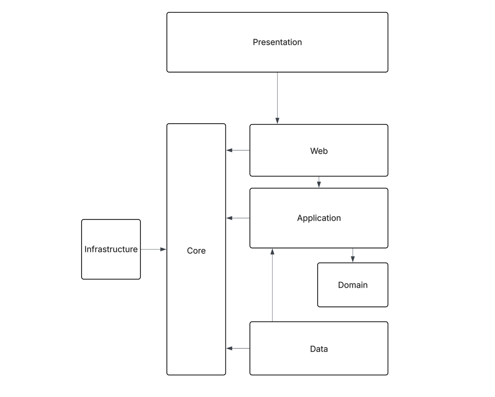
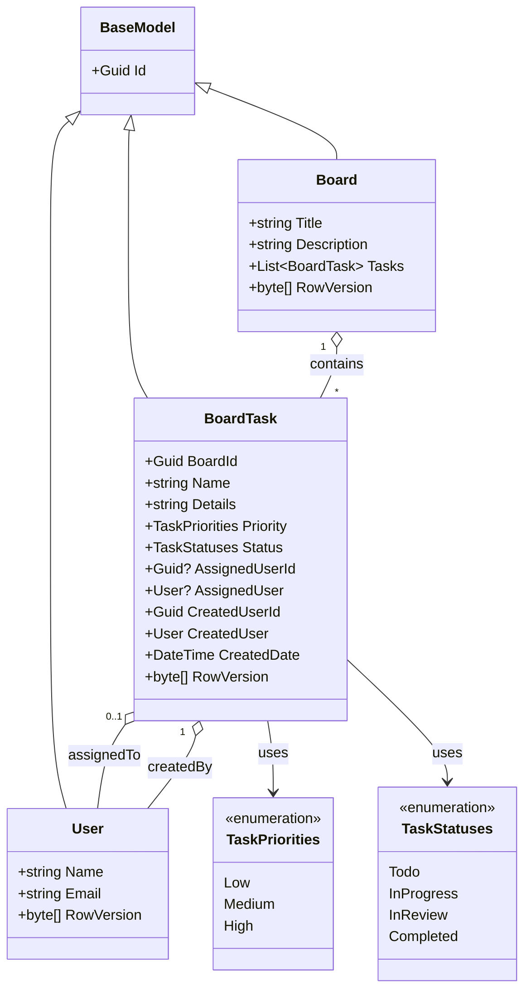
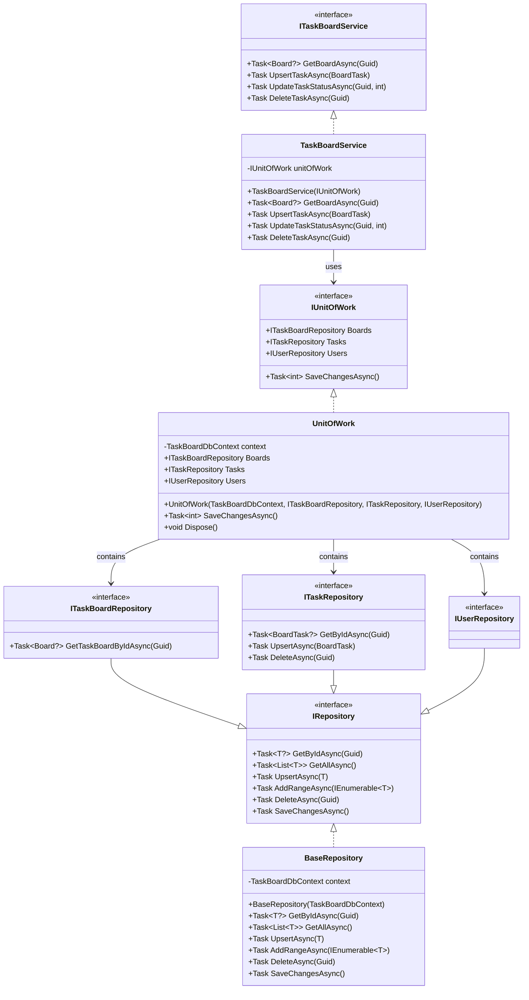

# TaskBoard 

## Overview
This document provides an architectural overview, class diagrams and my approach for designing the TaskBoard application.

---
## Scope and Assumptions

I have assumed this will be a production ready design and not a proof of concept or prototype. There are definitely much faster ways to build but I have assumed "quick and dirty" is not the requirement. The demand and scale requirements are expected to be modest to high otherwise I would be looking at other storage patterns such as CQRS and considering event queues. 

As multiple users can edit a task at the same time I have implemented optimistic locking where we use the row version to track if a version has changed since a user got the data, and if it has they would have to get the latest data and make their request again. As 
we are using an in-memory data store this will not actually work, but will work if deployed to use SQL Server. Pessimistic locking is also an option, to aqcuire a lock on the task before making changes.

The presentation layer, physical storage, logging, caching and security are out of the scope of this exercise.

I have omitted the password field from the user model as I am not illustrating use of it via user creation and password setting. A password is a very sensitive bit of data which is usually not passed around, especially not from server to client.
It is common practice today to use an identity provider such as Okta and Entra Id integrated through OAuth2 or SAML to take of auth. If we were to store the password, then of course we'd hash it.

Testing is also outside of scope, but I would use Playwright for automated testing and Moq for unit testing. I will include a unit test to show how I do this.

I would normally use controllers in the Web API but I had some difficulties getting it working with the OpenAPI docs and I did not want to get into resolving infrastructure issues. Therefore I am using a minimal API where its all in Program.cs.

---

## Application Architecture Diagram

I’ve used a layered architecture to separate high-level concerns, keeping related responsibilities cohesive with loose coupling between layers. This improves testability and allows implementations to be replaced with minimal impact.

Following the Dependency Inversion Principle, dependencies point inward towards the domain layer depending on abstractions rather than concrete implementations. High-level modules do not depend on low-level modules; instead, both depend on shared abstractions. Concrete implementations are composed and wired up at runtime using dependency injection.

The physical architecture is a client/server split with the presentation layer on the client-side and the web with everything behind it is on the server-side. The technical architecture and its how it scales out is outside of the scope of this exercise - but the servers will scale out horizontally like most web apps do, and all we need to do is to ensure our design is stateless on the webservers.

### Presentation Layer
The presentation layer is on the client side and it can be WPF, Blazor, React/SPA, iOS, Android and more. The design of the presentation layer is outside the scope of this exercise. The presentation layer communicates with the backend through the web api and is the intended consumer of what I have created here. As we do not have this, my code can be invoked throught the OpenAPI/Swagger page.
### Web / API
The web layer is the entry point and the composition root of the backend which depends on the application layer. The web layer is really just an integration/infrastructure layer and will be thin. All devices and client applications will communicate with the server side through this layer. Domain objects are often converted to a DTO so we only transfer over the internet what is required.
### Application / Services
The application layer is the next least dependant and contains services and application logic which coordinates the data and domain logic. This layer facilitates the use cases of the application. The web layer depends on the application layer not the other way around - so if we need to, we could switch out the web apis in favour of another technology without effecting application logic. 
### Domain / Business Layer
This architecture models the domain layer without dependencies. Even if the application layer and data layer changes domain can remain untouched. The domain does not know about the data layer, web layer or the application layer and should be persistence agnostic. Business rules 
### Data 
The Data layer depends on the Application layer, not the other way round. Because the datastore is abstracted behind this layer, we could swap one database technology for another without affecting the application and domain layers. Storage in a SQL database is probably still the best approach although an increasing number of NoSQL alternatives available. 
### Core and Infrastructure
Cross-cutting concerns will belong here such as logging, caching, notifications and configuration. Interfaces belong in the Core layer and the implementations belong in the Infrastructure layer.

My code does not contain comments as I am explaining here. Some developers believe in lots of comments while others believe it makes code less readable.

---

## Domain Model Class Diagram

I would have preferred to not have row version on the domain models as this is a requirement for concurrency tracking through EF. I would look to abstract this further by having separate objects for models and entities. 
However, although I do not like this the domain is not tightly coupled to EF or the repositories as taking them away will not change how the domain models or logic works.

## Service Layer Class Diagram

I have chosen to go with a repository pattern for data operations. The repositories can be mocked out for unit testing, and hides the underlying dbcontext from the application layer. A unit of work exposes these repositories and coordinates their operations into a transaction. EFCore was the choice of ORM to use here and set to in-memory storage for convenience.

## Technology Stack

Framework: ASP.NET Core 10  
Language: C# 14 
Database: EF Core (In-Memory provider) 
API Documentation: OpenAPI / Swagger 
Dependency Injection: Built-in ASP.NET Core DI

## Getting Started

1.   Clone the repository from GitHub
2.   Build the solution: dotnet build
3.   Run the application: dotnet run
4.   Access Swagger UI at https://localhost:7011/swagger

## Using the Swagger UI

I have setup some seed data so you can use the following data for input parameters:

BoardId - 02185f48-cb66-422a-9d1d-a718570a6290

UserId - 7678288a-acd6-43d8-b7ec-9eef42ab2f0d

TaskId - 5d6f314e-45ba-4bc4-a439-d81a8893b4d6

Another TaskId (so you can delete one) - 91250301-d791-4241-975f-c49249fe4590

Sample task payload for creating a task:

    {
        "id": null,
        "boardId": "02185f48-cb66-422a-9d1d-a718570a6290",
        "name": "name of task just added",
        "details": "details of task just added",
        "priority": 2,
        "status": 2,
        "assignedUserId": "7678288a-acd6-43d8-b7ec-9eef42ab2f0d",
        "assignedUser": null,
        "createdUserId": "7678288a-acd6-43d8-b7ec-9eef42ab2f0d",
        "createdUser": {
        "name": "Clark Kent",
        "email": "super@man.co.uk",
        "rowVersion": "EYqwMEhR3gg=",
        "id": "3fa85f64-5717-4562-b3fc-2c963f66afa6"
        },
        "createdDate": "2026-01-11T19:39:27.971Z",
        "rowVersion": "EYqwMEhR3gg="
    }

